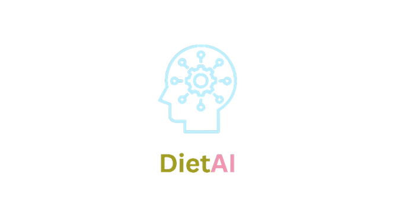

<h1 align="center">
  
</h1>

<h4 align="center">A diet recommending system which caters diet according to user needs.</h4>
<br>

<p align="center">
  <a href="#key-features">Demo</a> •
  <a href="#how-to-use">How To Use</a> •
  <a href="#support">Support</a>
</p>


## Demo

<a href="https://drive.google.com/file/d/1uK9vAaU3Q2ueZrgF5nHvJCwtw6MU7PLJ/view?usp=sharing"> Click here to view the demo video </a>

## How To Use

* First run the backend from  FINAL API/app.py
```bash
python -m flask run
```

* After that, create a database to store user info. You may run this using Apache server

* Then turn on live server from index.html

* You may now enter your details and get the diet recommendations

<br>

## Support

<br>

> GitHub [@nishit-chaudhary](https://github.com/nishit-chaudhary) &nbsp;&middot;&nbsp;
> LinkedIn [Nishit Chaudhary](https://www.linkedin.com/in/nishit-chaudhary-383a07229/)&nbsp;&middot;&nbsp;
> Instagram [@nishit._.chaudhary](https://www.instagram.com/nishit._.chaudhary/) 
